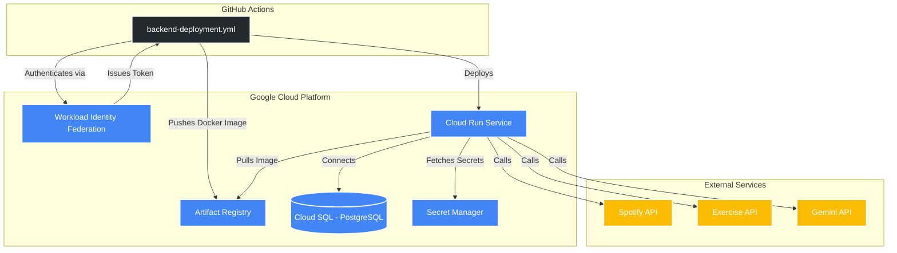

# Cloud Infrastructure Overview

This diagram illustrates the deployment pipeline and the runtime architecture of the SyncNSweat Backend on Google Cloud Platform.

```mermaid
graph TD
    subgraph CI_CD [GitHub Actions]
        Workflow[backend-deployment.yml]
    end

    subgraph GCP [Google Cloud Platform]
        IAM[Workload Identity Federation]
        AR[Artifact Registry]
        CR[Cloud Run Service]
        SQL[(Cloud SQL - PostgreSQL)]
        SM[Secret Manager]
    end

    subgraph External [External Services]
        Spotify[Spotify API]
        Exercise[Exercise API]
        Gemini[Gemini API]
    end

    %% Auth Flow
    Workflow -- Authenticates via --> IAM
    IAM -- Issues Token --> Workflow

    %% Build Flow
    Workflow -- Pushes Docker Image --> AR

    %% Deploy Flow
    Workflow -- Deploys --> CR
    CR -- Pulls Image --> AR

    %% Runtime Flow
    CR -- Connects --> SQL
    CR -- Fetches Secrets --> SM
    CR -- Calls --> Spotify
    CR -- Calls --> Exercise
    CR -- Calls --> Gemini
    
    classDef gcp fill:#4285F4,stroke:#fff,stroke-width:2px,color:#fff;
    classDef external fill:#fbbc04,stroke:#fff,stroke-width:2px,color:#fff;
    classDef cicd fill:#24292e,stroke:#fff,stroke-width:2px,color:#fff;

    class IAM,AR,CR,SQL,SM gcp;
    class Spotify,Exercise,Gemini external;
    class Workflow cicd;
```
